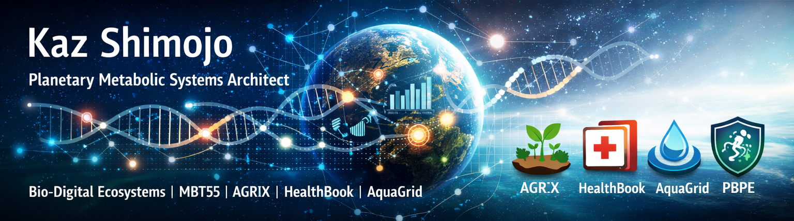

## Contents
- [English](#-kaz-shimojo--planetary-metabolic-systems-architect)
- [日本語 / Japanese](#-日本語版プロフィール)

## 🌍 Kaz Shimojo — Planetary Metabolic Systems Architect

### Architecting planetary‑scale metabolic systems across agriculture, health, water, and climate‑finance.

I design and orchestrate large‑scale bio‑digital systems that integrate regenerative agriculture, microbial metabolic engineering, digital health, water infrastructure, and climate‑finance architecture.

My work spans:
- MBT55 microbial metabolic theory & phenomics
- AGRIX regenerative agriculture & carbon‑positive food systems
- PBPE biosecurity & digital MRV
- HealthBook metabolic telehealth system
- AquaGrid deep‑ocean mineral water research
- Planetary Metabolic Operating System (PMOS)

I build architectures, dashboards, and operational systems that connect biology, data, and global sustainability.

## 🔭 What I’m working on
- Planetary Metabolic Operating System (PMOS)
- MBT55 impact models (food price, food loss, health cost, nutrition, agricultural economy)
- AGRIX regenerative agriculture platform
- PBPE × MBT55 coffee ecosystem
- HealthBook metabolic telehealth system
- AquaGrid water‑cycle engineering & deep ocean mineral research
- M3‑BioSynergy Core theory development

## 🧬 Tech Stack
- Python (Streamlit, FastAPI, scientific modeling, data engineering)
- Azure (Functions, Storage, App Services, ML workflows)
- GitHub Actions / Codespaces
- Snowflake / BigQuery
- Geospatial & climate data pipelines
- Scientific modeling (metabolic, microbial, ecological)

## 📌 Pinned Projects
- MBT55‑Impact‑Models — Planetary Health OS core models
- AGRIX — Regenerative agriculture × climate × economics
- PBPE‑Coffee — Biosecurity × MBT55 × supply‑chain MRV
- HealthBook — Metabolic telehealth platform
- AquaGrid — Water‑cycle engineering × deep ocean mineral science
- M3‑BioSynergy — Foundational microbial metabolic theory

## 🌐 Links
LinkedIn: https://www.linkedin.com/in/kaz-shimojo-bionexus

---

## 🇯🇵 日本語版プロフィール

### Kaz Shimojo — プラネタリーメタボリックシステム アーキテクト

私は、再生型農業、微生物代謝工学、デジタルヘルス、水インフラ、  
そして気候ファイナンスを統合する **地球規模のバイオ・デジタルシステム** を設計しています。

主な領域：
- MBT55 微生物代謝理論・フェノミクス  
- AGRIX 再生型農業・カーボンポジティブ食料システム  
- PBPE バイオセキュリティ・デジタル MRV  
- HealthBook 代謝ヘルス・テレヘルス  
- AquaGrid 水循環工学・深層海洋ミネラル研究  
- Planetary Metabolic Operating System（PMOS）

生物学・データ・インフラを統合し、持続可能な地球システムを構築しています。

---

## 🔭 現在取り組んでいるプロジェクト
- Planetary Metabolic Operating System（PMOS）  
- MBT55 インパクトモデル（食料価格・損失・健康コスト・栄養・農業経済）  
- AGRIX 再生型農業プラットフォーム  
- PBPE × MBT55 コーヒー生態系  
- HealthBook 代謝ヘルス・テレヘルス  
- AquaGrid 深層海洋ミネラル × 水循環工学  
- M3-BioSynergy 基礎理論  

---

## 🧬 技術スタック
- Python（Streamlit, FastAPI, 科学モデル, データエンジニアリング）  
- Azure（Functions, Storage, App Services）  
- GitHub Actions / Codespaces  
- Snowflake / BigQuery  
- 地球環境・気候データパイプライン  
- 代謝・微生物・生態系モデル  
